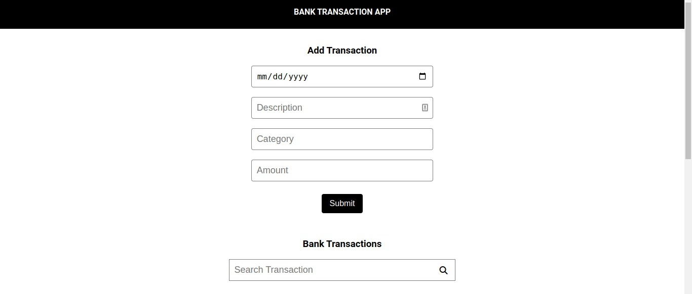
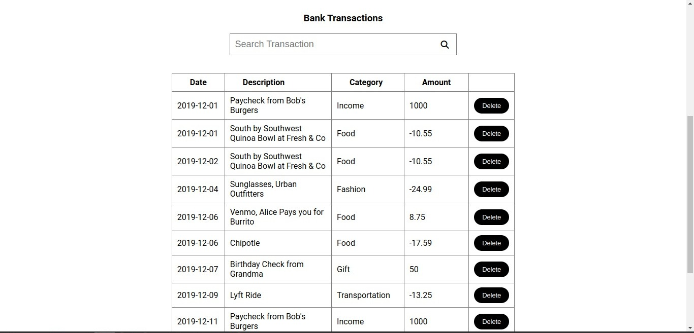

- # BANK APP

Is a web application that allows users to add new transactions through the dynamic form, delete selected transactions and allows users to filter specific transactions through the search bar.

# Setup Requirements

- Visual Studio Code, see [here](https://code.visualstudio.com/)
- Windows Subsystem for Linux (WSL), details [here](https://learn.microsoft.com/en-us/windows/wsl/install)
- Git and Github
- Node.js (includes npm), see [here](https://nodejs.org/en)
- json-server, see [here](https://www.npmjs.com/package/json-server)
- Any Modern Web Browser

# Installation

- Clone/Download the code from GitHub repository
- Navigate to the project directory
- Run npm install
- Run npm start to run the app on the browser
- The app should run on any modern web browser with JavaScript enabled

# Technologies

Technologies used in the project include:

- JavaScript
- JSX
- HTML
- CSS
- JSON
- json-server mock API using included db.json

# Screenshots

- HOME SECTION.

     

- TRANSACTIONS SECTION.

    

- FILTER SECTION.

   

## Authors

- [Gathoni Wanjira](https://github.com/Gathoni-Wanjira)

## Copyright

Released under the MIT License. See the [LICENSE](https://github.com/Gathoni-Wanjira) file.